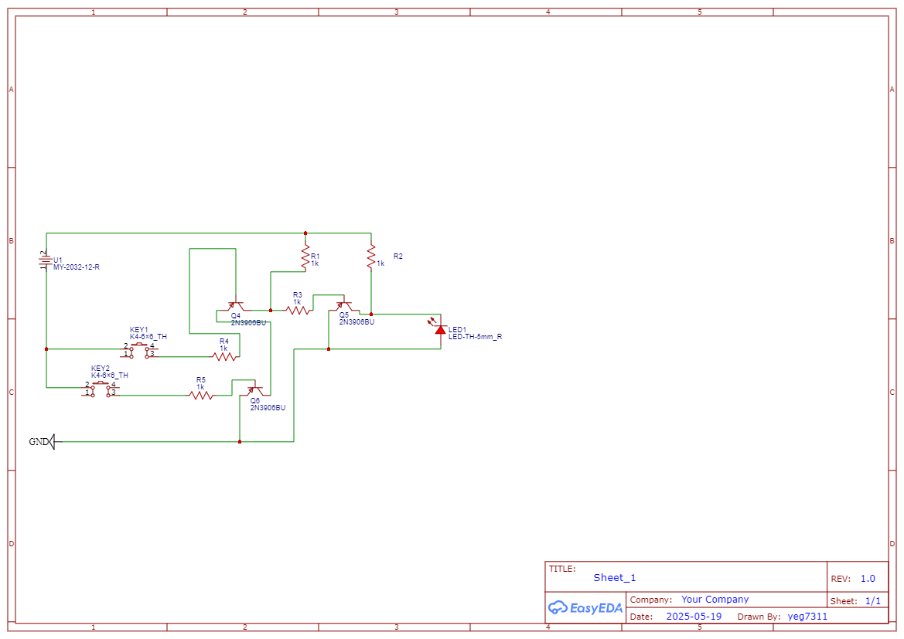
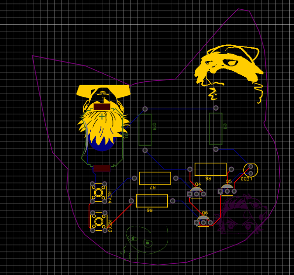

# AND Gate

## Description
This project implements a simple AND logic gate using a single 2N3904 NPN transistor, a 5 mm LED, a CR2032 coin cell, and a few resistors. When both inputs are driven HIGH (connected through input resistors to the battery), the transistor switches on, allowing current to flow through the LED and lighting it up. If either input is disconnected, the LED remains off, thus performing the logical AND operation.

## Bill of Materials
| Component                  | Specification         |
|----------------------------|-----------------------|
| 5 mm LED                   | Any standard LED      |
| 2N3904 transistor          | NPN, TO-92 package    |
| CR2032 battery cell        | 3 V coin cell         |
| Resistor (LED)             | 220 K                 |
| Resistor (input)           | 10 kΩ                 |

### Schematic

### PCB Layout

### 3D View

#### Slack username: Ye Gao
